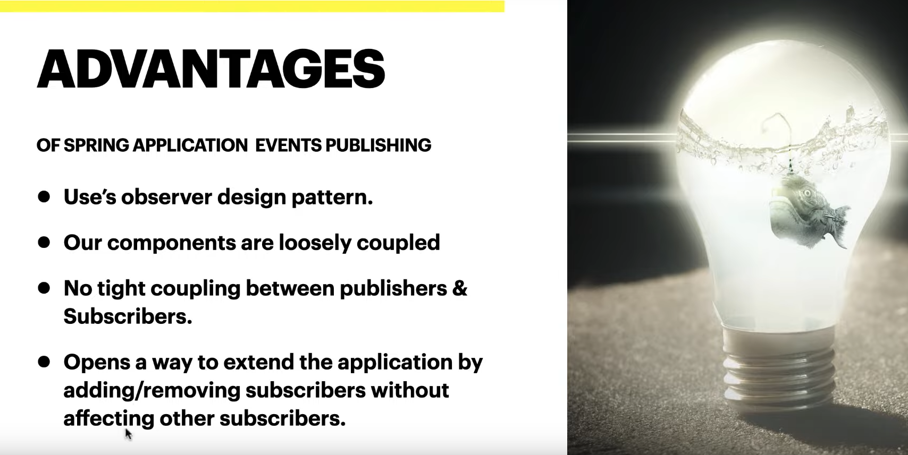
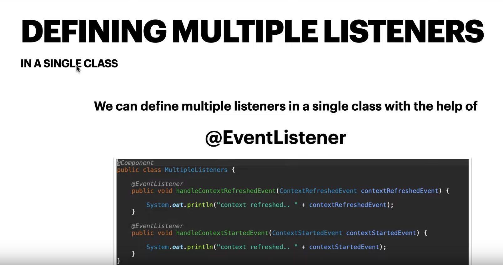
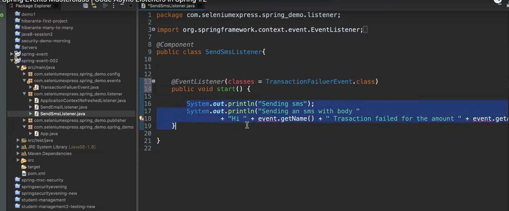
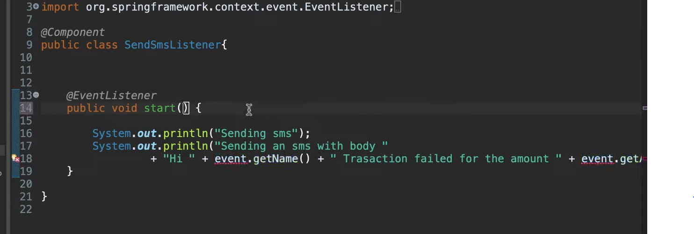
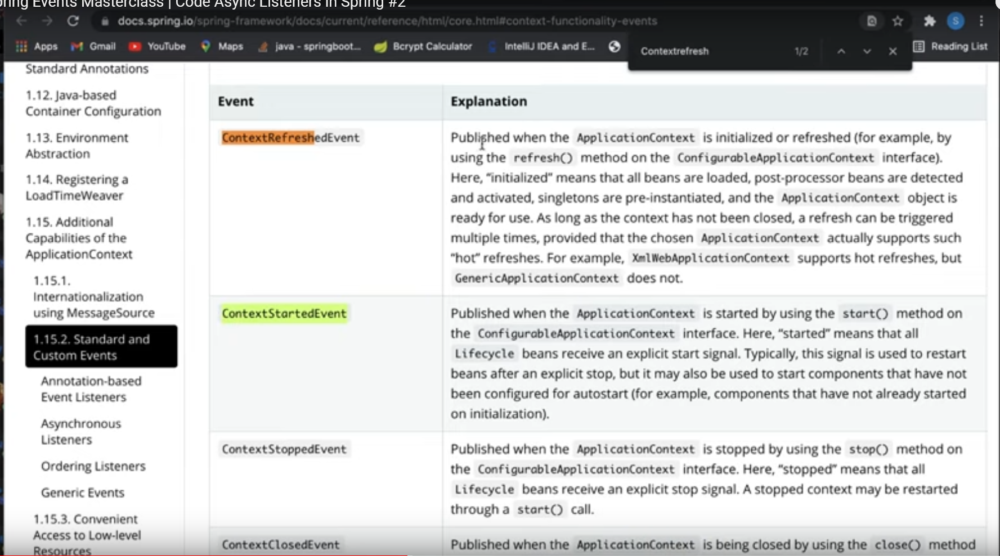
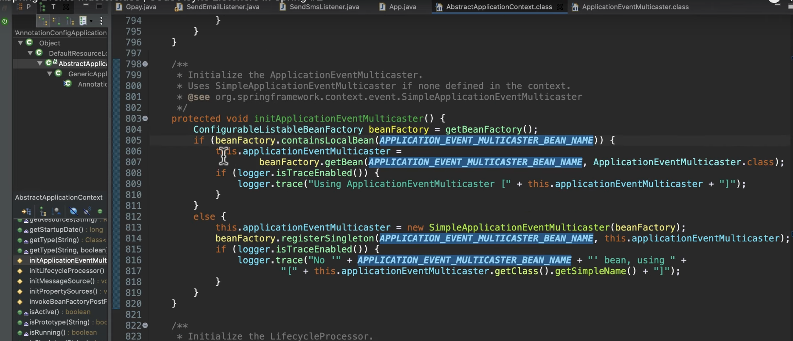
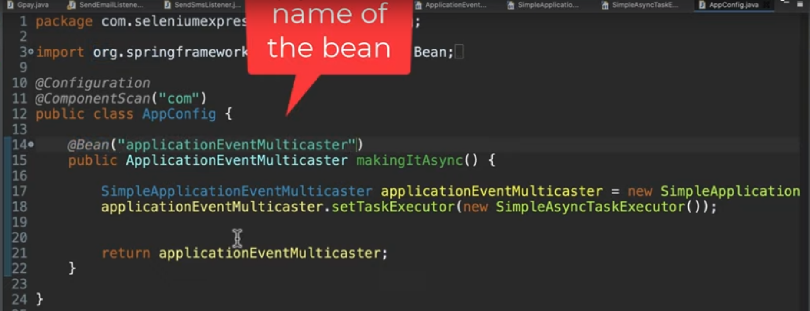

Abhilash Lecture:-
https://www.youtube.com/watch?v=xkWTO5M51FA [EP: 1]
https://www.youtube.com/watch?v=TwJ2Zbk28QM [EP: 2]

Event :- Whenever any activity needs to be trigger then we initiates using event.
Advantages:-

- It is notifying the listners (Users)
- There is not tight coupling between publisher and listners.

Ex:- 
When Transaction failed, trigger a sms, email to the customer.
When anyone is logging failed then event can be started.

=> defining multiple listners

=> listen to multiple events
   We can listen to multiple events using the @EVENTLISTENER ANNOTATION

It has a con's as if we are listing multiple events using EVENTLISTNER then we can use event based fields, 
Ex: In above Diagram we can see start method (which can be any naming convention), can not define getName etc of event class based variables

=> Exception due to @EVENTLISTNER

We can't define a @EventListener without an event as the argument.
means, in above example we need to EventListner as argument in start method or need to define in the annotation otherwise 
we will get exception

# we can use predefined Events using ApplicationEvent 

What is Synchronus?
=> One thread will wait till to complete other thread work, basically one thread will access resource at a time only.

# Sync VS Async call for event handling based on Listners

In above image, if we are calling Async listners then if block would be executed, otherwise else block.
Note:- firstly spring will check for all beans and if bean with name application_event_multicaster would be found means
it is a multithreaded (Async) call otherwise, in Sync call with by default class name SimpleApplicationEventMultiCaster

Async => ApplicationEventMultiCaster [Interface] [All listners are working in the separate thread], we need to define in
SimpleApplicationEventMultiCaster as Async by defing bean with ApplicationEventMultiCaster
sync => SimpleApplicationEventMultiCaster [Class]
 