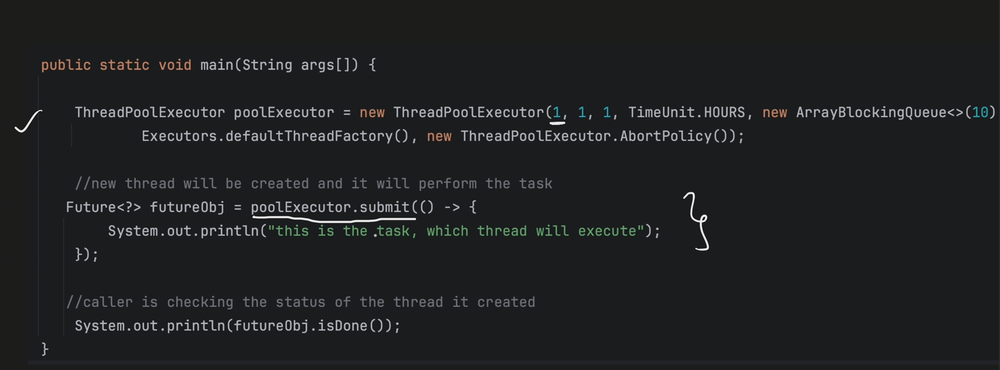
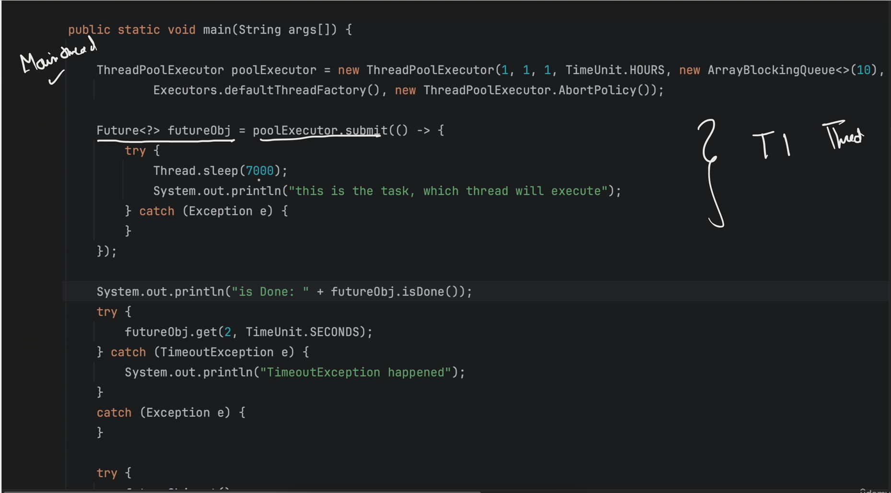
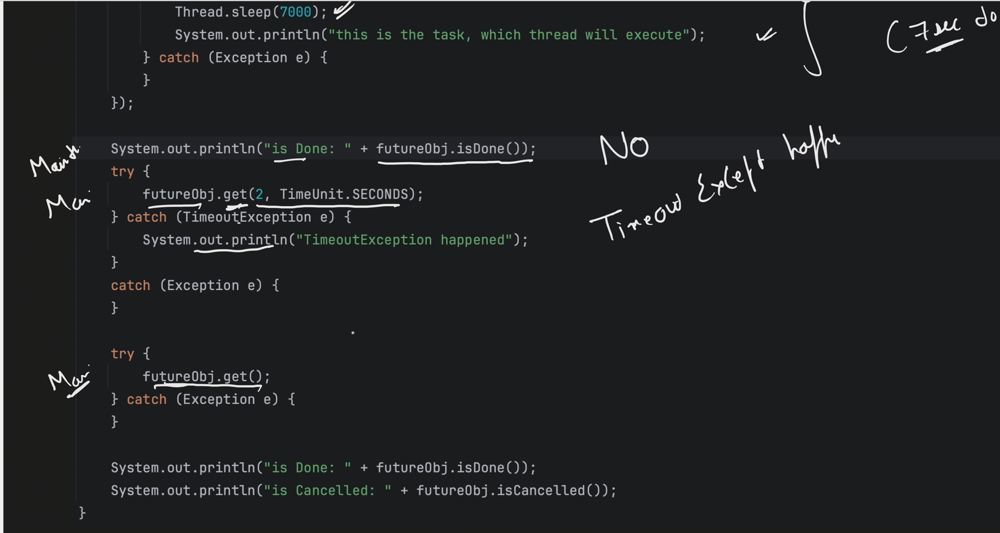
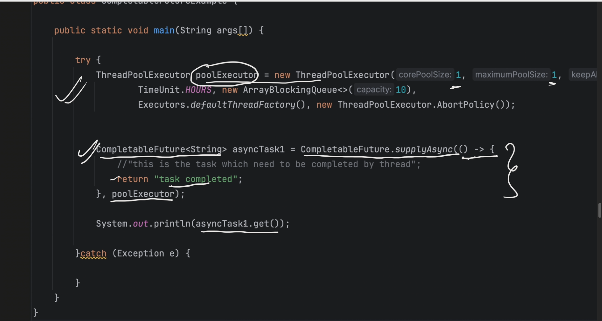
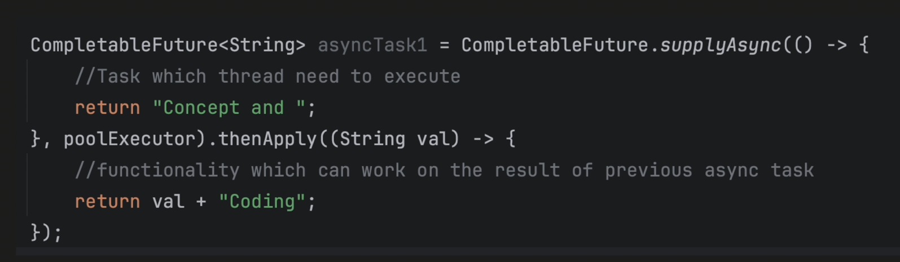
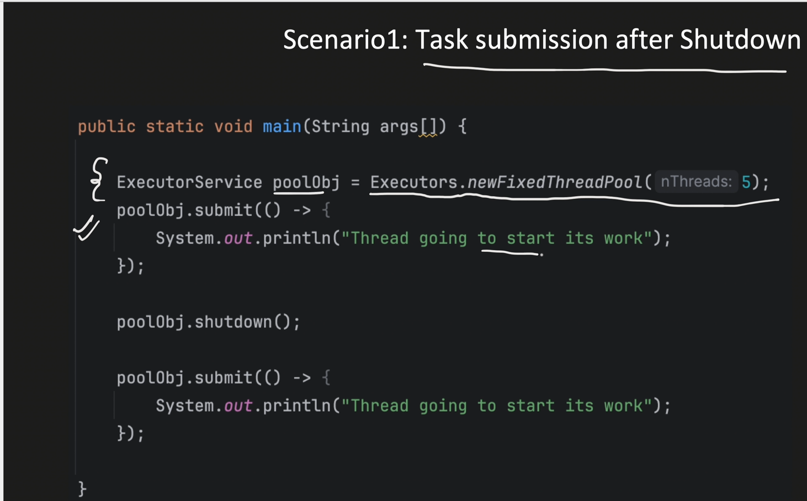
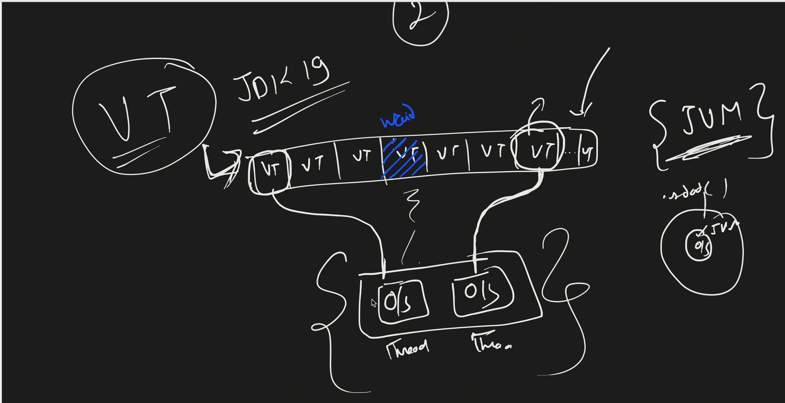

==============
MultiThreading vs Concurrency vs Paralleslism

Multithreading simply means there can be more than one thread running inside a process but not necessarily at the same time, maybe because of a single-core CPU. That means, though the application contains many threads, at a given point, only one thread gets executed by the CPU.

Whereas Concurrency is all about dealing with multiple threads or tasks at the same time because of the multiple CPU cores — Each core takes care of running one thread. If there are more threads in the application than the available cores then they interleave the CPU cores as per the Thread Scheduler.

Take a four-burner gas stove for example. You can cook 4 items concurrently at the same time. If you have more than four items, you have to deal with the cooking by prioritizing the items to be cooked, in which case you(the master chef) become the ThreadScheduler.

So, in a sense, multithreading is what enables concurrency. Without multithreading, there is no concurrency.

Then what about parallelism? We should not confuse concurrency with parallelism. Parallelism is about doing many sub-tasks of a single task at once whereas concurrency is about dealing with many tasks at the same time. We use parallelism mostly from a processing or computing perspective to achieve some performance.
==============

Process is an instance of a Program (It doesn't share memory)
Thread is a lightweight process (It does share memory)
A new JVM instance is created and allocated to new Process created.
each JVM Instance has its own stack, heap, data segment, pc, registers etc
register, stack and counter is sepeartely allocated to each thread
but Heap memory, code segment and data segment is sharable among all threads.
***code segment***
- contains the complied BYTECODE (machine code) of the java program
- its read only
- All threads within the same process, share the same code segment

***Data Segment***
- Contains the global and static variable
- All threads within the same process share the same data segment
- Threads can read and modify the same data.
- Synchronization is required between multiple threads

***Stack
- Each Thread has its own stack
- It manages, method calls, local variables.

***Register
- When JIT(Just-In-Time) complies converts the bytecode into native machine code, its uses register to optimize the generated machine code
- Also helps in context switching
- Each thread has its own Register

***Counter:
- Also, Know as Program Counter, it points to the instruction which is getting executed.
- Increments its counter after successfully execution of the instruction.

MultiThreading:-
- Allow a program to perform multiple task at the same time.
- Multiple threads share the same resource such as memory space but still can perform task independently.

MultiTasking vs MultiThreading

MultiTasking :-
Multiple processes/tasks are running parallely.
It doesn't share resources and memory.
For Cpu context switching happens within processes/tasks.
EX:- When multiple applications are running on a computer.
Multithreading :-
When within a process multiple threads are running to complete any task.  
It does share resources and memory.
For Cpu context switching happens within threads.
Ex:- text editor (writing, saving, autocorrecting happens all at a time)

Monitor lock -> It applies on object
Every object has monitor lock and if synchronized keyword based method called or (Synchonized based block method) on same object then as a time only one thread which is associated to object monitor lock can access that.
whereas other object based thread can access method/block based method if monitor lock is free for that other object.

Join:-
-> When Join method is invoked on a thread object. Current thread will be blocked and waits for the specific thread to finish.

-> It is helpful when we want to coordinate between threads or to ensure we complete certain task before moving ahead.

***Thread Priority****
1 (Low)
10 (High)
We can never rely on thread priority, because Thread scheduler will try to pick as per priority but there is no guaranty.

Daemon Thread => (Something which is Async), to define daemon thread we have to explicitly declare it.
(Daemon thread is alive untill any one user thread is alive)
If all users thread are dead then at the same moment daemon thread would be dead ex:- JVM has garbage collector which works on daemon thread, AutoSave in file, Logging of user when user work finished logging session also finished.
User Thread => The Thread which we define or main thread thread.

There are 4 types of custom locks( which doesn't depends upon object like monitor lock) it simply doesn't allow thread of any object to access critical section.

1) re-entrant Lock
   Reentrant reentrant = new Reentrant();
   reentrant.lock();
   Inside finally -> reentrant.unlock();

2) read-Write Lock [when Read is very high and write is low then readWrite Lock is the solution]
   [ Xclusive lock (Read, write) shared lock (only Read) ]
   If any thread has taken Xclusive lock then no other lock can be applied.
   ReadLock :- More than 1 thread can acquire the read lock
   WriteLock :- Only 1 thread can acquire the write Lock

ReadWriteLock lock = new ReentrantReadWriteLock();

lock.readLock().lock();
Inside finally -> lock.readlock().unlock();

lock.writeLock().lock(); 
Inside finally -> lock.writeLock().unlock();
3) stamped Lock (It supports ReadWrite Lock and Optimistic Lock both)

Locks are of two types
-> Pessimestic (-VE) (which uses lock/unlock)
-> optimistic (+VE) (which uses lock status/state)

[[[[[[[Stamped readWrite Lock]]]]]]]]
[Shared]
- StampedLock lock = new StampedLock();
  long stamp = lock.readLock();
  Inside finally -> lock.unlockRead(stamp);
  [Xclusive]
- StampedLock lock = new StampedLock();
- long stamp = lock.writeLock();
  Inside finally -> lock.unlockWrite(stamp);
  [[[[[[[[Stamped Optimistic Lock]]]]]]]]
  StampedLock lock = new StampedLock();
  long stamp = lock.tryOptimisticRead();
  if(lock.validate(stamp)){ // This section states that lock when read and now going to write operation any write operation has not happen in mean time.
  }
4) Semaphore Lock
   It is useful when we have to allow any specific number of threads at a time i.e by passing thread number
   Semaphore lock = new Semaphore(**Permits no of Threads** ex:- 2);
   lock.acquire();
   Inside finally -> lock.release();

[INTER-THREAD COMMUNICATION]
In Synchronization() monitor locks were used and they were using wait() and notifyAll() for inter-thread communication
In Custom Locks, we can't use [wait and notifAll] but we can use,
await() [Same as wait()]
signal() [Same as notify()]
but for that we have to use CONDITION on lock
Condition condition = lock.newCondition();
condition.signal();
condition.await();
condition.signalAll();

Concurrency can be achieved using
*******Lock Based Mechanism :-
1) Synchronized
2) Reentrant
3) Stamped
4) ReadWrite
5) Semaphores
   *******Lock Free Mechanism [FASTER]:- [CAS Operation (Compare-and-Swap)] : Lock Free Operations (It provides thread safty)
    VERY SPEIFIC USE CASE
   use case :- [Read the data value, Increment the value, update the value] ex:- counter++ ====> counter=counter+1;

    CAS (Memory, Expected VAlue, New Value)

1) AtomicInteger
2) AtomicBoolean
3) AtomicLong
4) AtomicReference

AtomicInteger :-
AtomicInteger counter = new AtomicInteger({{initial value}}0);
for increment => counter.incrementAndGet();

Volatile :- (It doesn't provide the thread safety) it just provide any change should be visible to all other threads.
Any change happen by a thread should be visible to all other threads
ex:- Assume System is 2 core based and two threads are operating on it to update any value which is initially 0 to add 1(one) in the value.
----without volatile case----
first thread will increase the value and put it into cache so, but other thread will read memory from main memory (RAM) and it will again increment it.
-----with volatile case----
As variable is declared volatile so, it will read from L1 cache first then L2 cache then from main memory in this order, second thread will find value in L1 cache itself.

--------------------What is ThreadPool???-------------------
- It is a collection of threads(aka workers), which are available to perform the submitted tasks.
- Once completed, worker thread get back to Thread Pool and wait for new task to assigned.
- Means threads can be reused.

How ThreadPool works??
-> when application submitting new task (Ex:- main thread submitted a task to executor thread pool) then Thread pool Executor checks for available thread from thread pool
if any thread is available then task is assigned to the thread.
if not then task is pushed to the queue for waiting of any available thread.

                    [########################################IMPORTANT########################################]
We don't create number of threads because due to this context switching time will increase and cpu idle time will also increase 
(So, Cpu instead of doing processing busy in context switching)
[CONLUSION] using control over thread creation, excess context switching can be avoided.

In ThreadPool
- Thread creation time can be saved
- overhead of managing the thread lifecycle can be removed.(Thread pool will manage it, on its own)
- Increased the performance as threads are reused due to less number of thread creation and less context switch (In this cpu does less performance due to idle)

JAVA FrameWork which helps to create thread pool [package java.util.concurrent] 
=> ThreadPool Executor [It helps to create customizable ThreadPool]
    public ThreadPoolExecutor(int corePoolSize,
    int maximumPoolSize,
    long keepAliveTime,
    TimeUnit unit,
    BlockingQueue<Runnable> workQueue,
    ThreadFactory threadFactory,
    RejectedExecutionHandler handler)
    Parameters:
corePoolSize - number of threads  are initially created and keep in the pool, even if they are idle.

maximumPoolSize - the maximum number of threads to allow in the pool. If number of thread are == corePoolSize and queue is also full
then new threads are created (till its less than 'maxPoolSize')
Excess Thread, will remain in pool, this is not shutdown or if allowCoreThreadTimeOut set to true, then excess thread get terminated
after remain idle for KeepAliveTime

allowcoreThreadTimeOut - [EXPLICITLY we have to set this in object to make keepAliveTime considerable]
If this property is set to TRUE (by default its false), idle thread kept Alive till time specified by 'keepAliveTime'

keepAliveTime - Thread, which are idle get terminated after this time. 
Ex:- 5 sec then after 5 sec thread would be terminated if thread was idle

unit - time unit for the keepAliveTime, whether Millisecond or Second or Hours etc.

maxPoolSize: [V V V V IMPORTANT]
Maximum number of thread allowed in a pool.
If no of thread are == corePoolSize and queue is also full, then new threads are created (till its less than 'maxPoolSize')

Excess thread, will remain in pool, this pool is not shutdown or if allowCoreThreadTimeOut 
set to true, then excess thread get terminated after remain idle for KeepAliveTime.

workQueue/Blocking queue - Queue used to hold task, before they got picked by the worker thread.
- > Bounded Queue : Queue with FIXED capacity.
ex:- ArrayBlockingQueue
- > Unbounded Queue: Queue with NO FIXED capacity.
ex:- LinkedBlockingQueue

threadFactory - factory for creating new Thread. ThreadPoolExecutor use this to create new Thread, this Factory provide us an interface to:
- To give custom Thread name
- To give custom Thread priority
- To set Thread Daemon flag etc (Daemon thread will gets ends when all users threads are completed Note:- main is also user thread)

handler - handler for tasks than can not be accepted by thread pool.
Generally logging logic can be put here. For debugging purpose 
        - new ThreadPoolExecutor.AbortPolicy
              - Throws RejectedExecutionException
        - new ThreadPoolExecutor.callerRunsPolicy
              - Executed the rejected task in the caller thread ( thread that attempted to submit the task)
        - new ThreadPoolExecutor.DiscardPolicy
              - Discard the oldest task in the queue, to accomodate new task.

## Future And callable with ExecutorService

     What if caller(i.e main thread) wants to know the status of the thread1, whether its completed or failed etc????? 
               Then, here comes [completable future]
     In ThreadPoolExecutor we are submitting the task but we don't know the exact status of submitted task 
     so, to know about that we have to use future

    Future: 
    Interface which Represents the result of the Async task.
    Means, it allow you to check if:
     computation is complete
     Get the result
     Take care of exception if any etc.

 
     
  Methods Available in Future Interface
  1) boolean cancel (boolean mayInterruptIfRunning) [this one is giving command to cancel]
       - Attempts to cancel the execution of the task.
       - Returns false, if task can not be cancelled (typically bcoz task already completed);
         returns true otherwise. 
  2) boolean isCancelled() [this one is only checking, whether it is completed or not]
       - Returns true, if task was cancelled before it get completed.
  3) boolean isDone() 
       - Returns true if this task completed.
       - Completion may be due to normal termination, an exception, or cancellation -- in all of these cases, this method will return true.
     
   4) V get() [Here, waiting for indefinetly]
       - wait if required, for the completion of the task.
       - After task completed, retrieve the result if available.
   
   5) V get(long timeout, TimeUnit unit)
       - wait if required, for at most the given timeout period
       - Throws 'TimeoutException' if timeout period finished and task is not yet  completed.

   
   
   
  # callable
    
    callable represents the task which need to be executed just like Runnable.
    But difference is :
    - Runnable do not have any Return type.
    - callable has the capability to return the value.

  # Runnable Interface Vs Callable Interface
    
    @FunctionalInterface
    public interface Runnable{
     public abstract void run()
    }

    @FunctionalInterface
    public interface Callable<V> {
     V call() throws Exception
    }

  When ever we are submitting any task using submit method it accepts using three ways 
     - submit(Runnable)
     - submit(Runnable, T)
     - submit(Callable<T>) 
  
  when we do normally 
 [TYPE 1]
  Future<?> future = executor.submit( () -> {}); // we are using normal Runnable
 [TYPE 2] this is almost same as callable but with runnable workaround to acheive callable
  Future<Integer> future = executor.submit( () -> {
                                                // anything
                                                return 30;
                                                }, Integer); // we are using Runnable, T
  [TYPE 3] this is runnable case 2 cleaner way
  Future<Integer> future = executor.submit(() -> {});

## CompletableFuture

https://www.callicoder.com/java-8-completablefuture-tutorial/
 
Introduced in Java 8
To help in Async Programming
We can consider it as an advanced version of Future
provides additional capability like chaining

How to use this:

1. CompletableFuture.supplyAsync:

   public static<T> CompletableFuture<T> supplyAsync(Supplier<T> supplier) // here we are not passing Executor means 
    it will use default poolExecutor which is Fork-Join Pool

   public static<T> CompletableFuture<T> supplyAsync(Supplier<T> supplier, Executor executor)

  Note:- supplyAsync has return type is CompletableFuture<T> T=> any type 
   
   - supplyAsync method initiates an Async operation
   - 'supplier' is executed asynchronously in a separate thread
   - If we want more control on Threads, we can pass Executor in the method.
   - By default, its uses, shared Fork-Join Pool executor. It dynamically adjusts its pool size based on processors.

    Note:- when supplyAsync() method would be called, one new thread gets started.
           like earlier we were creating when used to call submit() method.
  Q. what is supplier()?
     - It is similar to Runnable Interface where run method was there to execute thread, 
       here get() method is inside Supplier Interface (Functional Interface).
   

2. thenApply & thenApplyAsync: [this is a concept of chaining in Completable future]
   - Apply a function to the result of previous Async computation.
   - Return a new CompletableFuture object.
   - ThenApply method is a Synchronous execution, It uses same thread which completed the previous Async task.
   - ThenApplyAsync is a Asynchronous execution, It uses different thread (From 'fork-join' pool, if we do not provide the executor in the completableFuture of this function) 
   - If Multiple 'thenApplyAsync' is used, ordering can not be guaranteed, they will run concurrently.

   
3. thenCompose and thenComposeAsync:
   
   - chain together dependent ***Async*** operations.
   - Means when next ***Async*** operation depends on the result of the previous ***Async*** one.
     we can tie them together.
   - For ***Async*** tasks, we can bring some Ordering using this.

4. thenAccept and thenAcceptAsync:
   - Generally end stage, in the chain of Async operations
   - It does not return anything

5. thenCombine and thenCombineAsync:
   - Used to combine the result of 2 Comparable Future
   

Note:- [ThreadPoolExecutor which we are using is also called custom thread pool Executor]

Executors provides Factory methods which we can use to create Thread Pool Executor. 
which is present in "Java.util.concurrent" package

 1) Fixed ThreadPoolExecutor 
   - newFixedThreadPool method creates a thread pool executor with a fixed no of threads.
   - Min and Max Pool Size => same
   - Queue Size => Unbounded Queue
   - Thread Alive When idle => Yes
   - when to use => when we have Exact Info like how many threads we need, how many Async task is needed
   - Disadvantage => Not good when workload is heavy, as it will lead to limited concurrency

   // fixed thread pool Executor 
      ExecutorService poolExecutor1 = Executors.newFixedThreadPool(5);
      poolExecutor1.submit( () -> "this is the async task");
 
 2) cached ThreadPoolExecutor:
    
    newCachedThreadPool method creates a thread pool that creates a new thread as Needed (dynamically).
    - Min and Max Pool => Min 0 Max: Integer.MAX_VALUE
    - Queue Size = Blocking Queue with Size 0, because when ever any new task comes new thread is creating to handle the task 
       if existing threads are busy
    - Thread Alive when idle => 60 Seconds (After 60 sec idle thread gets terminated)
    - when to use : Good for handling burst of short-lived tasks.
    - Disadvantage : Many long-lived tasks and submitted rapidly, 
                     ThreadPool can create so many threads which might lead to increase memory usage.

    // cached thread pool Executor
    ExecutorService poolExecutor1 = Executors.newCachedThreadPool(5);
    poolExecutor.submit( () -> "this is the async task");

 3) Single ThreadPoolExecutor
 
    - 'newSingleThreadExecutor' creates Executor with just single Worker thread.
    - Min and Max Pool => Min 1 Max: 1
    - Queue Size = Unblocking Queue
    - Thread Alive when idle => Yes
    - when to use : When need to process tasks sequentially
    - Disadvantage : No concurrency at all
    
4) WorkStealing Pool Executor
 
  - It creates a Fork-Join Pool Executor
  - Number of threads depends upon the Available Processors or we can specify in the parameter.

   There are 2 Queues:
   - submission Queue
   - Work-Stealing Queue for each thread (it's a Dequeue)

   Steps:
    - If all threads are busy, task would be placed in "Submission Queue". (or whenever we call submit() method, tasks goes into submission
    queue only)
    - Lets say task1 picked by ThreadA and if 2 subtasks created using fork() method. Subtask1 will be executed by ThreadA only and Subtask2
      is put into the ThreadA work-stealing queue.
    - If any other thread becomes free, and there is no task in Submission queue, it can "STEAL" the task from the other thread work-stealing
      queue.
 
    - Task can be split into multiple small sub-tasks. For that Task should extend:
        - Recursive Task : if subtask return any value then go for it
        - RecursiveAction : if subtask doesn't return any value then go for it.
  
    - We can create Fork-Join Pool using "newWorkStealingPool" method in ExecutorService. 
      Or By calling ForkJoinPool.commonPool() method

   Priority for thread to pick any Task:
     1) check its own work-stealing Queue
     2) check submission Queue
     3) can I steal some task from busy thread work-stealing queue, If yes then put in own work-stealing queue and start working on it.

 # shutdown vs await Termination vs shutdownNow
   
    **Shutdown**  
 
   - Initiates orderly shutdown of the ExecutionService.
   - After calling 'Shutdown', Executor will not accept new task submission.
   - Already Submitted tasks, will continue to execute.

   

   In above example as we are submitting task after initiating shutdown so, we will get exception.

   **AwaitTermination** [It is a just checking, whether executor pool has shut down or not?]
   - It's an optional functionality. Return true/false.
   - It is used after calling 'Shutdown' method.
   - Blocks calling thread for specific timeout period, and wait for ExecutorService shutdown.
   - Return true, if ExecutorService gets shutdown within specific timeout else false.

   **shutdownNow**
   - Best effort attempt to stop/interrupt the actively executing tasks
   - Halt the processing of tasks which are waiting
   - Return the list of tasks which are awaiting execution.
   
   
 # ScheduledThreadPoolExecutor # (It is a child of threadPoolExecutor)

 - Helps to schedule the tasks 
               ThreadPoolExecutor ------------> ScheduleThreadPoolExecutor
 - because this is child of ThreadPoolExecutor all methods of that is also present in 
   ScheduledThreadPoolExecutor
 - ScheduledThreadPoolExecutor methods are as  [Difference between Runnable an Callable is Runnable doesn't return any value but callable does]
               - schedule(Runnable command, long delay, TimeUnit unit) => Schedules a Runnable task  after specific delay.
                                                                       => only one time task runs.
               - schedule(Callable<V> callable, long delay, TimeUnit unit) => Schedules a callable task after specific delay.
                                                                       => only one time task runs.
               - scheduleAtFixedRate(Runnable command, long initialDelay, long period, Timeunit unit)
                                                                       => Schedules a runnable task for repeated execution with fixed rate.
                                                                       => We can use cancel method to stop this repeated task.
                                                                       => Also, lets say, if thread1 is taking too much time to complete 
                                                                       the task and next task is ready to run, till previous task will not 
                                                                       get completed, new task can not be start(it will wait in queue).
               - scheduleWithFixedDelay(Runnable command, long initialDelay, long delay, TimeUnit unit)
                                                                       => Schedules a Runnable task
Repeated execution with      fixed delay (Means next task delay     counter start only after         previous one task complete)

# ThreadLocal, Virtual Thread vs Normal Thread #

- ThreadLocal class provide access to Thread-Local variables.
- This 'Thread-Local' variable hold the value for particular thread
- Means each thread has its own copy of thread-Local variable.
- We need only 1 object of ThreadLocal class and each thread can use it to set and get its own Thread-variable.
 
======>[ Remember to clean up, if reusing the thread ]<========
ex:- If there are 5 tasks and 2 threads in the ThreadPoolExecutor, then only these threads will work on the 5 tasks,
completing each task one by one. For instance, if thread1 completes task1 and returns it to the thread pool to be assigned
a new task, it's important to note that each thread has its own thread-local variable. This variable is independent of tasks. 
Therefore, if thread1's thread-local variable holds a value related to task1, the same value will be visible when another new
task is assigned. Hence, it's necessary to clean up the thread-local variable before reusing it for another task.
==================================

# Virtual Thread vs Platform Thread(Normal Thread)

  Moto of Virtual Thread : To get Higher throughput not latency
  
 throughput => in 1 sec how much tasks you can complete
 ex:- if A can complete 10 tasks in 1 sec and B can complete 100 tasks in 1 sec then B throughput is higher than A.
 latency =>

 Platform Thread (normal Thread) :-
 Whenever we create a normal thread, the JVM generates a platform thread, and this thread is then created as an OS thread.
 This means that for each platform thread, one OS thread is created, establishing a one-to-one mapping, essentially an OS 
 thread with a wrapper Platform thread.

 However, there are disadvantages to this approach:
 1) It is slow because every time we submit a Java thread, the platform thread invokes a system call to create an OS thread, 
   which consumes time.
 2) For instance, if a platform thread is waiting for any I/O operation, the associated OS thread also has to wait, 
   resulting in the wastage of an OS thread.

 Virtual Thread :- [Available after java 19]
 Whenever we create a virtual thread, the JVM links it to an OS thread (here, a one-to-one mapping does not occur). 
 For instance, if we have two OS threads and the JVM creates multiple VTs (virtual threads), when a virtual thread needs to run, 
 it links to an OS thread.

 For example, if a virtual thread waits for an I/O operation, the linking between the virtual thread and the OS thread would be
 broken, allowing other virtual threads waiting in the queue to utilize the OS thread.

 

 How to create virtual thread:- 
 Thread th1 = Thread.ofVirtual().start(RunnableTask);
 or
 ExecutorService myExecutorObj = Executors.newVirtualThreadPerTaskExecutor()
 myExecutorObj.submit(Runnabletask)
 

 